Git Practice Assignment

This document demonstrates the Git commands practiced during the assignment along with screenshots.

## Branch and Checkout

Screenshot :

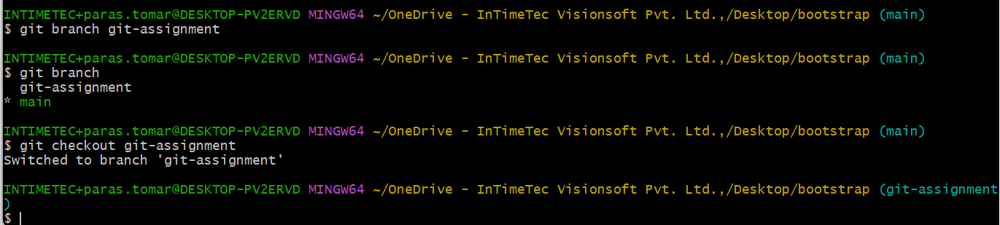

## Making Files

Screenshot :

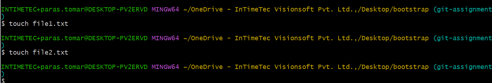

## Modify Files

Screenshot :

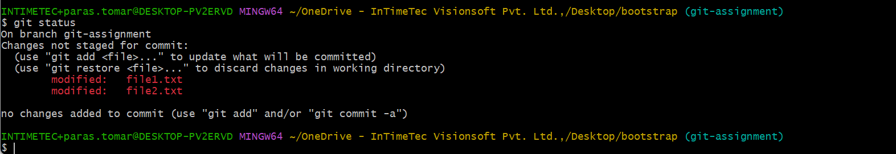

## cd and pwd

Screenshot :

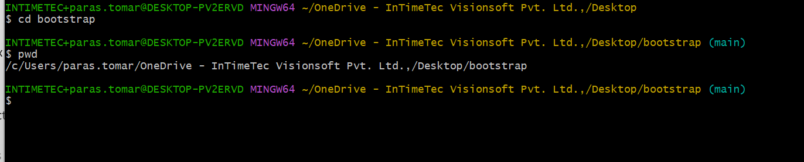

## git add

Screenshot :

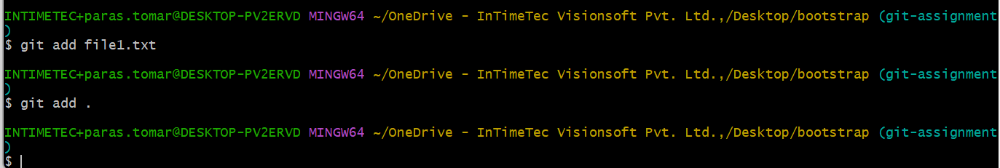

## git branch

Screenshot :

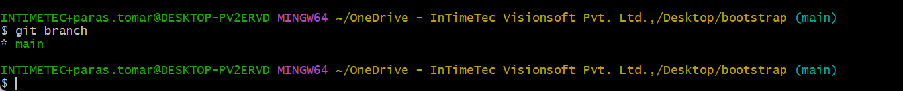

## new feature branch

Screenshot :

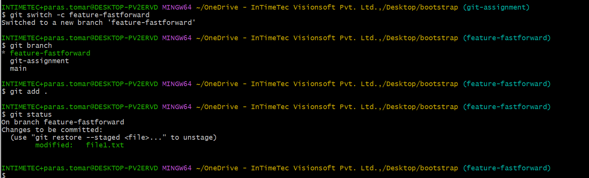

## git clone

Screenshot :

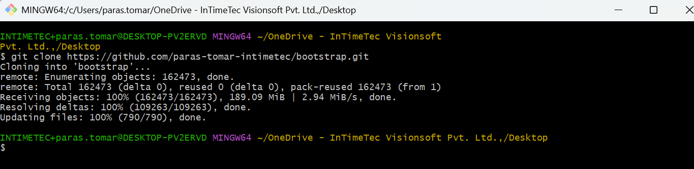

## git commit -m

Screenshot :

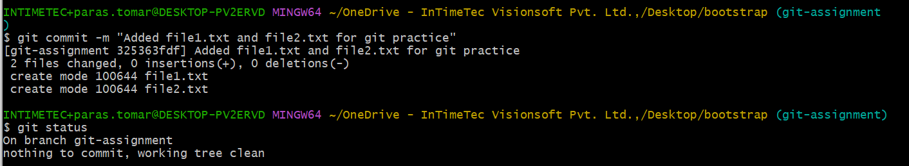

## git log

Screenshot :

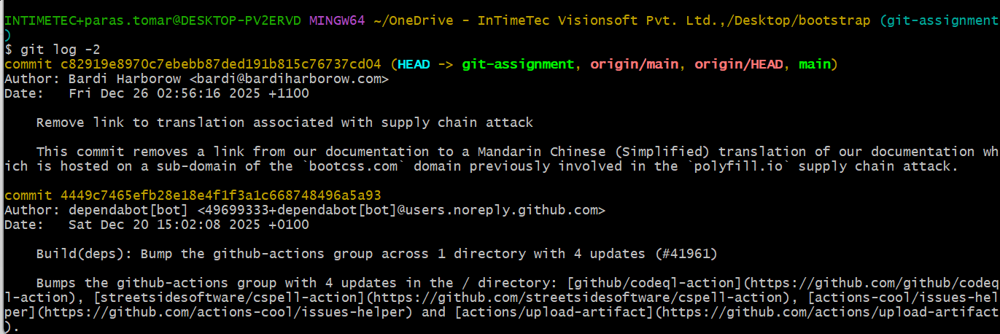

## git diff

Screenshot :

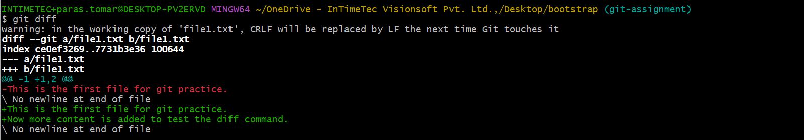

## git remote -v

Screenshot :

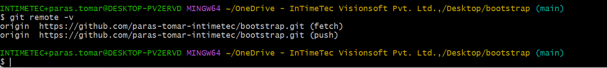

## git reset

Screenshot :

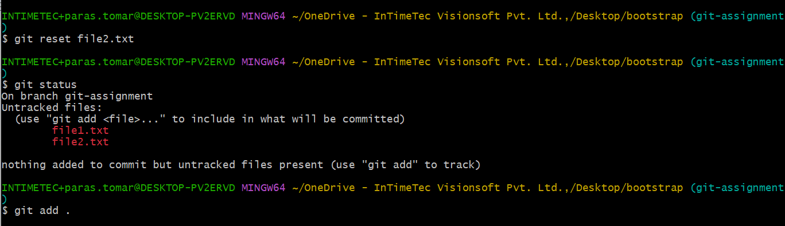

## git restore --staged

Screenshot :

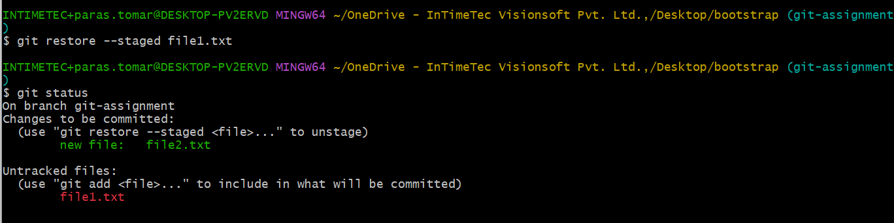

## git restore

Screenshot :

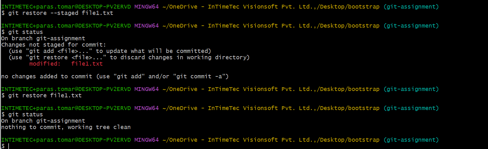

## git merge (fast forward)

Screenshot :

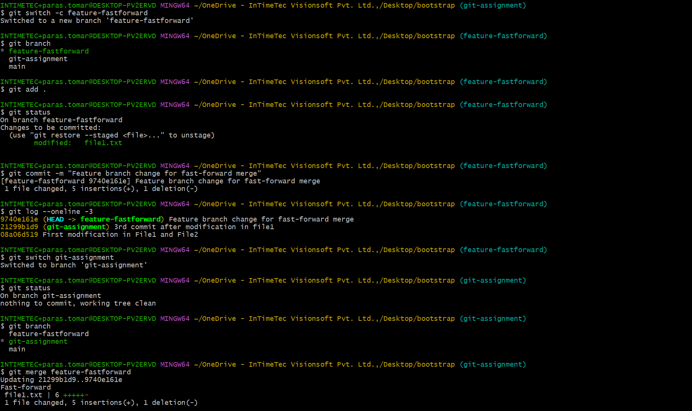

## merge conflict

Screenshot :

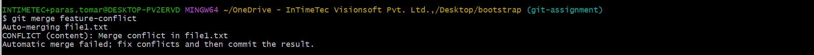

## merge conflict solved

Screenshot :

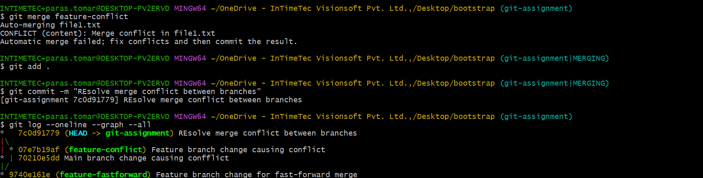

## git stash

Screenshot :

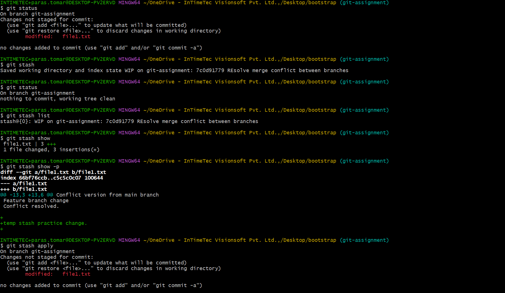

## git cherry-pick

Screenshot :

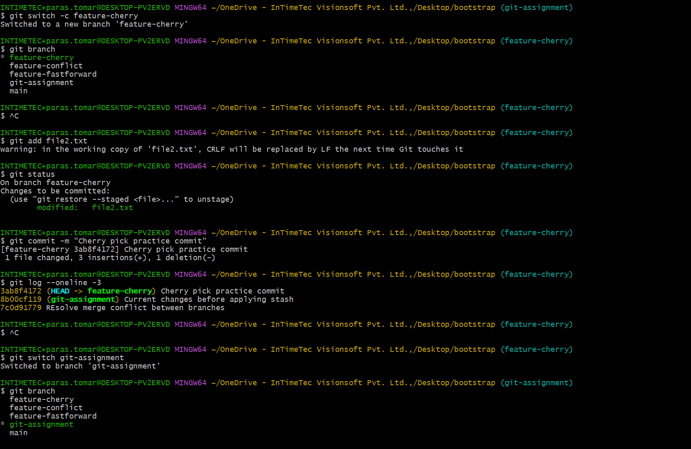
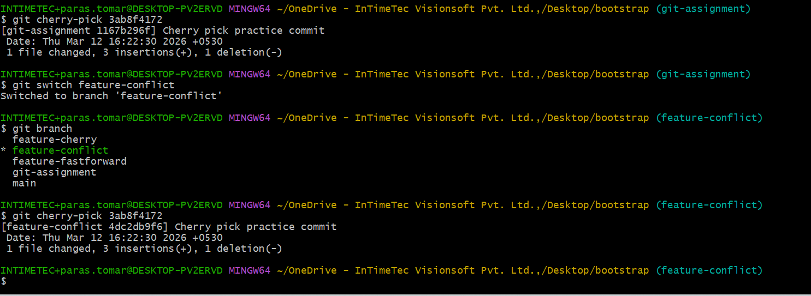

## git push

Screenshot :
 
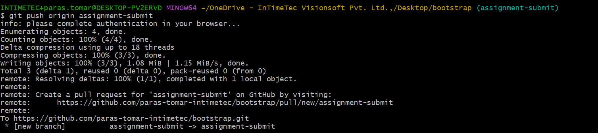
